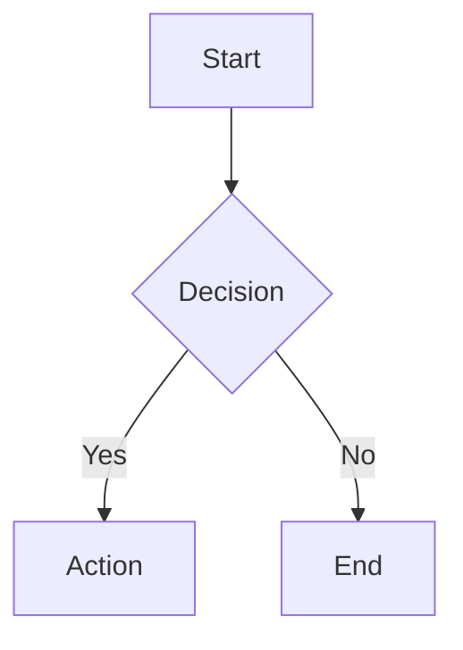
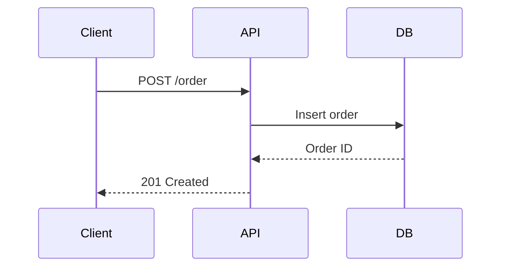
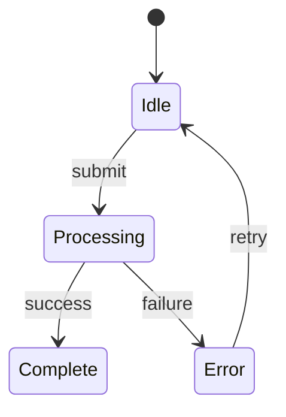
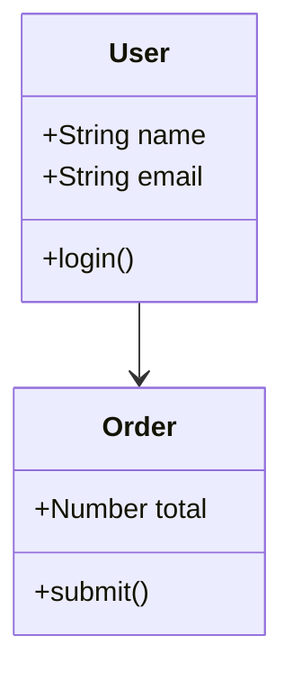
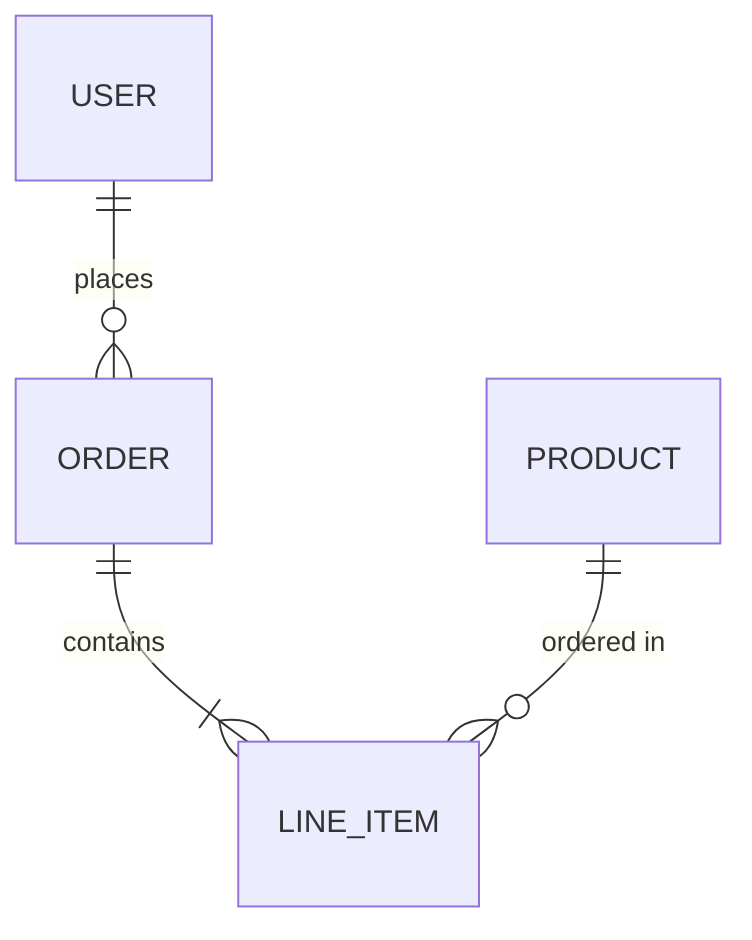

# Mermaid Diagram Skill

Generate professional diagrams from Mermaid syntax using `beautiful-mermaid` (npm). Outputs SVG files for visual use or ASCII art for terminal display.

## When to Use

- User asks to "diagram", "visualize", "draw", or "map out" something
- Architecture diagrams, data flows, state machines
- Sequence diagrams for API flows
- Class diagrams for code structure
- ER diagrams for database schemas
- Any time a visual would clarify a concept

## Prerequisites

The skill needs a temporary Node.js script to render. It will:
1. Check if `beautiful-mermaid` is installed globally or locally
2. If not, install it temporarily via `npx`
3. Generate the output

## Workflow

### Step 1: Determine Output Format

Ask the user directly in plain language if the preferred output format is not already clear:

- Header: "Output"
- Question: "How do you want the diagram?"
- Options:
  - "ASCII (terminal)" — Renders box-drawing characters right in the terminal. Best for quick visualization while coding.
  - "SVG file" — Opens a styled SVG in the browser. Best for sharing, docs, or presentations.
  - "HTML file" — Full themed HTML page with the diagram. Best for dark/light theme control.

### Step 2: Write the Mermaid Syntax

Based on what the user wants to visualize, write valid Mermaid syntax. Supported diagram types:

**Flowchart:**


**Sequence:**


**State:**


**Class:**


**ER Diagram:**


### Step 3: Render the Diagram

#### Option A: ASCII Output (Terminal)

Create and run a temporary script:

```bash
cat > /tmp/render-mermaid.mjs << 'SCRIPT'
import { renderMermaidAscii } from 'beautiful-mermaid'

const diagram = `
MERMAID_SYNTAX_HERE
`

console.log(renderMermaidAscii(diagram))
SCRIPT

cd /tmp && npm install beautiful-mermaid 2>/dev/null && node render-mermaid.mjs
```

Display the ASCII output directly in the conversation.

#### Option B: SVG File Output

```bash
cat > /tmp/render-mermaid.mjs << 'SCRIPT'
import { renderMermaid } from 'beautiful-mermaid'
import { writeFileSync } from 'fs'

const diagram = `
MERMAID_SYNTAX_HERE
`

const svg = await renderMermaid(diagram, {
  bg: '#1a1b26',
  fg: '#a9b1d6',
})

writeFileSync('/tmp/diagram.svg', svg)
console.log('SVG written to /tmp/diagram.svg')
SCRIPT

cd /tmp && npm install beautiful-mermaid 2>/dev/null && node render-mermaid.mjs && open /tmp/diagram.svg
```

#### Option C: HTML File Output

```bash
cat > /tmp/render-mermaid.mjs << 'SCRIPT'
import { renderMermaid } from 'beautiful-mermaid'
import { writeFileSync } from 'fs'

const diagram = `
MERMAID_SYNTAX_HERE
`

const svg = await renderMermaid(diagram, {
  bg: '#0a0f1c',
  fg: '#a9b1d6',
  accent: '#7aa2f7',
  line: '#3d59a1',
  muted: '#565f89',
  surface: '#292e42',
  border: '#3d59a1',
})

const html = `<!DOCTYPE html>
<html>
<head>
  <meta charset="UTF-8">
  <title>Diagram</title>
  <style>
    body {
      margin: 0;
      display: flex;
      justify-content: center;
      align-items: center;
      min-height: 100vh;
      background: #0a0f1c;
      padding: 2rem;
    }
    svg {
      max-width: 100%;
      height: auto;
    }
  </style>
</head>
<body>
${svg}
</body>
</html>`

writeFileSync('/tmp/diagram.html', html)
console.log('HTML written to /tmp/diagram.html')
SCRIPT

cd /tmp && npm install beautiful-mermaid 2>/dev/null && node render-mermaid.mjs && open /tmp/diagram.html
```

### Step 4: Save to Project (Optional)

If the user wants to keep the diagram:

- Ask where to save it (e.g., `docs/architecture.svg` or `docs/diagrams/flow.html`)
- Copy from `/tmp/` to the project directory
- If saving to a project, also save the Mermaid source as a `.mmd` file alongside it for future editing

## Theme Presets

Use these for quick theming:

**Dark (default):**
```js
{ bg: '#1a1b26', fg: '#a9b1d6' }
```

**Tokyo Night:**
```js
{ bg: '#1a1b26', fg: '#a9b1d6', accent: '#7aa2f7', line: '#3d59a1', muted: '#565f89' }
```

**GitHub Dark:**
```js
{ bg: '#0d1117', fg: '#c9d1d9', accent: '#58a6ff', line: '#30363d', muted: '#8b949e' }
```

**Light:**
```js
{ bg: '#ffffff', fg: '#1a1a2e', accent: '#3b82f6' }
```

**Terminal Green:**
```js
{ bg: '#0d1117', fg: '#39d353', accent: '#39d353', line: '#21262d' }
```

## Tips

- For complex diagrams, build incrementally - start with the main flow, then add detail
- ASCII output works great for quick inline visualization while pair-programming
- SVG output is better for documentation and sharing
- The Mermaid source (`.mmd` file) is the "source of truth" - always save it alongside rendered output
- Use `graph LR` for left-to-right flows, `graph TD` for top-down
- Keep node labels short - long text breaks ASCII rendering

## Error Handling

- If `beautiful-mermaid` fails to install, fall back to raw Mermaid syntax in a code block
- If ASCII rendering looks broken (very complex diagrams), suggest SVG output instead
- If the diagram type isn't supported (pie charts, gantt, etc.), note the limitation and render as plain Mermaid code block

## Examples

**User:** "diagram the API flow for our checkout"
**Action:** Write a sequence diagram showing Client -> API -> Stripe -> DB flow, render as ASCII

**User:** "visualize the database schema"
**Action:** Write an ER diagram from the schema, render as SVG and open in browser

**User:** "map out the state machine for order processing"
**Action:** Write a state diagram, render as ASCII for quick terminal view
